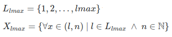
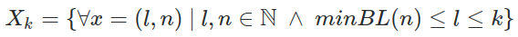
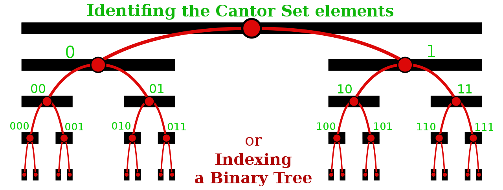

# SizedBigInt

* For main implementation, see  [src/SizedBigInt.mjs](src/SizedBigInt.mjs), runs with NodeJS and main browsers.

* For demos and simplified implementations, see  [src](src). The assert files are at [data/assert*.txt](data).

Text, etc. **under construction**.

## Introduction

Sometimes we need [natural numbers](https://en.wikipedia.org/wiki/Natural_number), but a kind of number where 0 is not equal to 00.

Sized BigInt's are arbitrary-precision integers ([BigInt](https://developer.mozilla.org/en-US/docs/Web/JavaScript/Reference/Global_Objects/BigInt)) with defined number of bits, to represent hashes, labels, encodings, hierarchical indexes or any other that need to differenciate `0` and `00`,  preserving all other numeric interpretations, like order (`002`&gt;`001`) and the freedom to translate its positional  notation to  [some especific radix](https://en.wikipedia.org/wiki/Radix#In_numeral_systems) (e.g. binary to quaternary or hexadecimal).

## Basic examples

The following examples  can be mathematically described as a **finite sets** of numeric representations.  Limiting examples in 8 bits:

* Samples of base2 representations:  <i>X</i><sub>1</sub>&nbsp;=&nbsp;{`0`, `1`} &nbsp; <i>X</i><sub>2</sub>&nbsp;=&nbsp;{`0`, `00`, `01`, `1`, `10`, `11`} &nbsp; <i>X</i><sub>3</sub>&nbsp;=&nbsp;... <br/><i>X</i><sub>8</sub>&nbsp;=&nbsp;{`0`, `00`, `000`, `000`,..., `00000000`, `00000001`, ..., `11111111`}.

* The same set <i>X</i><sub>8</sub> without some (non-compatible) items, expressed in [quaternary (base4)](https://en.wikipedia.org/wiki/Quaternary_numeral_system): <br/><i>Y</i><sub>8</sub>=&nbsp;{`0`, `00`, `000`, `0000`, `0001`, `0002`, `0003`, `001`, `0010`, `0011`, ..., `3333`}.

Ordering the illustred elements. The order in ordinarry mathematical *sets* is arbitrary, but to group or list elements we can adopt some order.  The main ordering options for typical SizedBigInts are the **lexicographic order**, to enhance "same prefix" grouping or hierarchy; and the **numeric order**, using the bit-length as first criterium.

Here a set of elements illustrated with different representations, listed by lexicographic order of the binary representation:

&nbsp;&nbsp; TABLE-1

```
                    Representation   
    (size,value)   Binary              Base4
    (1,0)	    0
    (2,0)	    00                       0
    (3,0)	    000
    (4,0)	    0000                     00
    (5,0)	    00000
    (6,0)	    000000                   000
    (7,0)	    0000000
    (8,0)	    00000000                 0000
    (8,1)	    00000001                 0001
    (7,1)	    0000001
    (8,2)	    00000010                 0002
    (8,3)	    00000011                 0003
    (6,1)	    000001                   001
    (7,2)	    0000010
    (8,4)	    00000100                 0010
    (8,5)	    00000101                 0011
    ...            ...                      ...
```
## Formal definition

Each SizedBigInt is an *element* of a [*set*](https://en.wikipedia.org/wiki/Set_theory). The formal definition of this *set* is the mathematical reference-concept for implementations.

As showed in Table-1 we can represent elements of a set *X* as [ordered pairs](https://en.wikipedia.org/wiki/Ordered_pair), (*l*,*n*) of bit&#8209;length&nbsp;*l*  and numeric value&nbsp;*n*, a Natural number.  Supposing a minimum bit-length function, *minBL()*, the set <b><i>X</i><sub>k</sub></b> is a SizedBigInt set constrained by  *k*, the maximum number of bits:
<!---->



where


## Representations

Natural numbers can be expressed with [positional notation](https://en.wikipedia.org/wiki/Positional_notation), using the rule of "remove [leading zeros](https://en.wikipedia.org/wiki/Leading_zero)".  The rule is used in any base (radix) representation.

The SizedBigInt's are like BigInt's **without the rule of remove leading zeros**, and the SizedBigInt must be the same in any base representation. This last condiction is a problem: as we see at table-1, there are no base4 representation for `0`, because each digit in base4 need 2 bits.

### Base2

The base2 representation is the simplest and **the canonic** one. The **SizedBigInt Base2 string representation** is the usual base2 augemented with the "use leading zeros" rule. So `00` is a valid SizedBigInt Base2 number, and is not equal to&nbsp;`0`.

### Base4h

How to convert base2 one-digit numbers `0` and `1` to base4? <br/>(we talking about **SizedBigInt Base4 string representation** illustred at table-1)

The solution is to use a fake digit that represent these values. To avoid cofusion with hexadecimal letters we can start with `G` to represent `0` and `H` to represent `1`.  It will be named **half digits** because the ordinary base4 digits use two bits.

&nbsp;&nbsp; TABLE-2

```
    (size,value)    Binary                   Base4h
    (1,0)	    0                        G
    (2,0)	    00                       0
    (3,0)	    000                      0G
    (4,0)	    0000                     00
    (5,0)	    00000                    00G
    (6,0)	    000000                   000
    (7,0)	    0000000                  000G
    (8,0)	    00000000                 0000
    (8,1)	    00000001                 0001
    (7,1)	    0000001                  000H
    (8,2)	    00000010                 0002
    (8,3)	    00000011                 0003
    (6,1)	    000001                   001
    (7,2)	    0000010                  001G
    (8,4)	    00000100                 0010
    (8,5)	    00000101                 0011
    ...             ...                      ...
    (7,127)         1111111                  333H
    (8,254)         11111110                 3332
    (8,255)         11111111                 3333
```
Base4h numbers are strings with usual base4 pattern and the halfDigit as optional suffix. This syntax rule can be expressed by a [regular expression](https://en.wikipedia.org/wiki/Regular_expression):

```js
/^([0123]*)([GH])?$/
```
To translate from binary, only values with odd number of bits will be translate the last bit as halfDigit. The complete translation table, from binary to base4 representations, is:

```json
{ "0":"G", "1":"H", "00":"0", "01":"1", "10":"2", "11":"3" }
```

### Base16h

We can use base16 (hexadecimal representation) for any integer, but when controling the bit-length can use only base16-compatible lengths: 4 bits, 8 bits, 12 bits, ... multiples of 4.

So, how to represent sized integers as `0`, `1`, `00`, `01`, `10`, ...  ?

The solution is to extend a hexadecimal representation, in a similar way to the previous one used for [base4h](#Base4h): the last digit as a fake-digit that can represent all these incompatible values  &mdash; so using the halphDigit values `G` and `H` for 1-bit values, and including more values for 2 bits (4 values) and 3 bits (8 values). The total is 2+4+8=14 values, they can be represented by the letters `G` to `T`.

The name of this new representation is **Base16h**, because it is the ordinary Base16 "plus an optional halfDigit", by **h** shortening *half*.  Its string pattern is:

```js
/^([0-9a-f]*)([G-T])?$/
```
&nbsp;&nbsp; TABLE-3

```
value    Binary     Base16h
(1,0)	0       	G
(2,0)	00      	I
(3,0)	000     	M
(4,0)	0000    	0
(5,0)	00000   	0G
(6,0)	000000  	0I
(7,0)	0000000 	0M
(8,0)	00000000	00
(8,1)	00000001	01
(7,1)	0000001 	0N
(8,2)	00000010	02
(8,3)	00000011	03
(6,1)	000001  	0J
...
(6,63) 	111111  	fL
(7,126)	1111110 	fS
(8,252)	11111100	fc
(8,253)	11111101	fd
(7,127)	1111111 	fT
(8,254)	11111110	fe
(8,255)	11111111	ff
```

To translate from a binary string with *b* bits, there are `b % 4` last bits to be translated as special digits. Splitting the value as binary prefix (`part[0]`) and suffix (`part[1]` with 1, 2 or 3 last bits),
```js
let part = strbin.match(/^((?:[01]{4,4})*)([01]*)$/)
```
the prefix will be translated to usual hexadecimal number, and the suffix, when exists,  translated by this complete "bits to haslDigit" map:

```json
{
 "0":"G","1":"H",
 "00":"I","01":"J","10":"K","11":"L",
 "000":"M","001":"N","010":"O","011":"P","100":"Q","101":"R","110":"S","111":"T"
}
```
-------------

## Implementation using BigInt

The BigInt Javascript primitive datatype ...

Run *demo* with NodeJS using `node  --experimental-modules demo.mjs | more`.

1. Simplest didactic implementations: test with [demo01.mjs](src/demo01.mjs) (check by its  [assert01.txt](data/assert01.txt)),

   1.1. With a pair (*size*,*value*) as in the set definition.  [SizedBigInt-didacticOpt1.mjs](src/SizedBigInt-didacticOpt1.mjs).

   1.2. With a "hidden bit" into the BigInt values: [SizedBigInt-didacticOpt2.mjs](src/SizedBigInt-didacticOpt2.mjs).

2. Complete main implementation: see [**SizedBigInt.mjs**](src/SizedBigInt.mjs). <br/>Can be tested by `demo01.mjs` also with  [`demo02.mjs`](src/demo02.mjs) (check by its  [assert02.txt](data/assert02.txt)).

## Examples

```js
'use strict';
import SizedBigInt from './SizedBigInt.mjs';

let x1 = new SizedBigInt('aaf4c', 16); // (val,radix,bits) a base16 initialization
let x2 = new SizedBigInt('012G');      // default base4h string val
let y1 = new SizedBigInt(1234567890123456789n); // BigInt val
let y2 = new SizedBigInt(123,null,55); // Number val, initialized with 55 bits
let z  = new SizedBigInt();  // z is null, can be changed by z.fromInt(123)

console.log('toString: ' + [x1,x2,y1,y2,z], "\nDebug object:", x1)
// toString: [20,700236],[7,12],[61,1234567890123456789],[55,123],[0,null]
// Debug object: SizedBigInt { bits: 20, val: 700236n }
console.log('x1 Base4h: ', x1.toString('4h'),"x1 Base32:", x1.toString(32))
// x1 Base4h:  2222331030   x1 Base32: lbqc
```

To test and see another  examples, see demo01 and demo02 described [above](#Implementation using BigInt).

<!--
LIXO
## Applications

Diversos counjuntos fractais (construídos por recorrência) podem ter seus elementos indexados por números

https://en.wikipedia.org/wiki/Cantor_set

https://peerj.com/articles/cs-171/

https://en.wikipedia.org/wiki/Binary_tree



Here some illustrative applications, no one is real, because it is a new issue:

1. [Geohash](https://en.wikipedia.org/wiki/Geohash): it is a geographical encoding standard, that use base32 representation, and  it is impossible to translate to base4 or base16. In fact, the base4 is formally the hierarchical structure of complete 2-bit per latitude-longitude level.

  1.1. Geohash local shortcodes: ...

  1.2. Geohash half-levels: ...

2. Trucated [cryptographic hashes](https://en.wikipedia.org/wiki/Cryptographic_hash_function): the standard hashes are too long to humans, the most usual is to adopt some truncation level, to compare two hashes or to show a list of few hashes. The truncation can be used also as alternative stantandard, discrding original hash.

  2.1. [SHA1](https://en.wikipedia.org/wiki/SHA-1) example. The SHA1 standard use 160 bits (20 bytes). After truncate it to 30 bits, how to  represent it in hexadecimals  preserving the same prefix? With base16h is possible.<br/>   SHA1("hello")=`aaf4c61ddcc5e8a2dabede0f3b482cd9aea9434d`.  Trucanding 3 digits, `aaf`, so 3*4=12 bits.  Truncating to any number of bits **preserving prefix**: to 13 bits `aafG`, to 21 bits `aaf4cG`, to 35 bits `aaf4c61dS`, to 38 bits `aaf4c61ddL`.<br/>PS: standard hexadecimal conversion for same numbers will be `aaf`, `155e`, `155e98`, `557a630ee`  and `2abd318777`.

-->

## Foundations
There are some alternative theoretic foundations: [2-adic number](https://en.wikipedia.org/wiki/P-adic_number) system, binary labels (indexes) of nodes of [Complete Binary Tree](https://en.wikipedia.org/wiki/Binary_tree) or binary labels (identifiers) of elements of [Cantor Set](https://en.wikipedia.org/wiki/Cantor_set). The most simple is to use Cantor Set.


<!--
To a complete guide see the [project's page at `ppKrauss.github.com/SizedBigInt`](http://ppKrauss.github.com/SizedBigInt).
-->

## Terminology

* Base: the web standards, as  [RFC&#160;4648](https://tools.ietf.org/html/rfc4648), use the term "base", but Javascript (ECMA-262) adopted the term "radix" in [`parseInt(string, radix)`](https://developer.mozilla.org/en-US/docs/Web/JavaScript/Reference/Global_Objects/parseInt). The preferred term is *base*.

* Base alphabet: is the "encoding alphabet", a set of UTF-8 symbols used as digit values of a specific base.

* Base label: each pair (base,alphabet) need a short label. In the [*SizedBigInt class*](src/SizedBigInt.mjs) some labels was defined: `base2`, `base4`, `base4h`, `base8`, `base16`, `base16h`, `base32`, `base32ghs`, `base32hex`, `base32pt`, `base32rfc`, `base64`, `base64url`,  `base64rfc`.

* Binary and base2: sometimes  is necessary to remember that a BigInt is an internal *binary* representation. The preferred term for string-representation is *base2*.

* Default alphabet: is the alphabet adopted as standard for a specific base, associated with the label "baseX", for example "base4" is a synonymous for "base4h" in the SizedBigInt conventions.

* Padding: SizedBigInt's are numbers where *padding zeros* make difference (0 is not equal to 00). In some other conventions for base-encoded data, the padding is maked by a character like "=", so, it must be converted to zero.

* Set, element, number, natural number and integer are terms of the [Set Theory](https://en.wikipedia.org/wiki/Set_theory), the formal mathematical foundation used here.  In implementation context the  Javascript semantic for integer, class, number, etc. is preferred.

* Size and length: The term "size" was used in the title of this project, but the usual term for "size of the string" is *length* and, for binary numbers,  [bit-length](https://en.wikipedia.org/wiki/Bit-length),  the preferred term.

------

&#160;&#160;Contents, data and source-code of this git repository are dedicated to the public domain.<br/>&#160;&#160;[](https://creativecommons.org/publicdomain/zero/1.0/)
