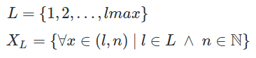

# SizedBigInt
Sized BigInt's are arbitrary-precision integers with defined number of bits, to represent hashes, labels and hierarchical indexes.

Hierarchical identifiers, labels and indexes... All can use digits as character-strings, differenciating `0` and `00`, `1` and `001`, but preserving all other numeric interpretations, like order (`002>001`) and freedom for represantation ([some other radix](https://en.wikipedia.org/wiki/Radix#In_numeral_systems)).  

## Basic examples

The examples can be mathematically described as a **finite set** of numeric representations.  Limiting examples in 8 bits:

* Example with binary representations:  <i>X</i><sub>1</sub>&nbsp;=&nbsp;{`0`, `1`} &nbsp; <i>X</i><sub>2</sub>&nbsp;=&nbsp;{`0`, `00`, `01`, `1`, `10`, `11`} &nbsp; ... <br/><i>X</i><sub>8</sub>&nbsp;=&nbsp;{`0`, `00`, `000`, `000`,..., `00000000`, `00000001`, ..., `11111111`}.

* The same set <i>X</i><sub>8</sub> without some (non-compatible) items, in [radix 4](https://en.wikipedia.org/wiki/Quaternary_numeral_system) representation: <i>Y</i><sub>8</sub>=&nbsp;{`0`, `00`, `000`, `0000`, `0001`, `0002`, `0003`, `001`, `0010`, `0011`, ..., `3333`}.

Ordering the illustred elements. The order is arbitrary for a set, but to group or list elements we can adopt some order.  The main ordering options are the lexicographic, to enhance "same prefix" grouping or hierarchy, and the numeric orderder using the size as first criterium.

Here an illustration of a list of elements with different representations, and in lexicographic order:

<center>TABLE-1</center>
```
    (size,value)   Binary representation    Radix4 representation
    (1,0)	       0
    (2,0)           00                       0
    (3,0)	       000
    (4,0)	       0000                     00
    (5,0)	       00000
    (6,0)	       000000                   000
    (7,0)	       0000000
    (8,0)	       00000000                 0000
    (8,1)	       00000001                 0001
    (7,1)	       0000001
    (8,2)	       00000010                 0002
    (8,3)	       00000011                 0003
    (6,1)	       000001                   001
    (7,2)	       0000010
    (8,4)	       00000100                 0010
    (8,5)	       00000101                 0011
    ...            ...                      ...
```
## Definition

Each element of this set can be mapped into a *size* (bits or number of digits) and a Natural number (*value*). &nbsp; PS:  the usual term for "size of the string" is *length* (or [bit-length](https://en.wikipedia.org/wiki/Bit-length)), so we prefer to use it in the formal definitions.

So we can say that the elements of a set  *X* of this (named) class of sets are ordered pairs (*l*,*n*) of length *l* and numeric value *n*. See the  table illustrating.

Supposing a maximal length *lmax*, the set <b><i>X</i><sub>L</sub></b> is a class in *L*:



## Representations

Natural numbers can be expressed with [positional notation](https://en.wikipedia.org/wiki/Positional_notation), using the rule of "remove [leading zeros](https://en.wikipedia.org/wiki/Leading_zero)".  The rule is used in any radix representation.

The SizedBigInt's are like BigInt's **without the rule of remove leading zeros**, and the SizedBigInt must be the same in any radix representation. This last condiction is a problem: as we see at table-1, there are no radix4 representation for `0`, because each digit in radix4 need 2 bits.

### Binary
The binary representation is the simplest and the canonic one, so it is the reference-representation.

### Radix4h
How to represent `0` and `1` in radix4?

The solution is to use a fake digit that represent these values. To avoid cofusion with hexadecimal letters we can start with `G` to represent `0` and `H` to represent `1`.  The will be named **half digits** because  the other radix4 represent two bits, twice.

<center>TABLE-2</center>
```
    (size,value)    Binary                   Radix4h
    (1,0)	       0                        G
    (2,0)	       00                       0
    (3,0)	       000                      0G
    (4,0)	       0000                     00
    (5,0)	       00000                    00G
    (6,0)	       000000                   000
    (7,0)	       0000000                  000G
    (8,0)	       00000000                 0000
    (8,1)	       00000001                 0001
    (7,1)	       0000001                  000H
    (8,2)	       00000010                 0002
    (8,3)	       00000011                 0003
    (6,1)	       000001                   001
    (7,2)	       0000010                  001G
    (8,4)	       00000100                 0010
    (8,5)	       00000101                 0011
    ...             ...                      ...
    (7,127)         1111111                  333H
    (8,254)         11111110                 3332
    (8,255)         11111111                 3333
```
The complete translation table, from binary to radix4 representations, is:

```json
{ "0":"G", "1":"H", "00":"0", "01":"1", "10":"2", "11":"3" }
```
The Radix4h

### Radix16h

The problem here is bigger tham radix4 because each hexadecimal digit  needs four binary digits. The solution is analog: to add "fake digits".

The complete translation table, from binary to radix16 representations, is:

```json
{
 "0":"G","1":"H",
 "00":"I","01":"J","10":"K","11":"L",
 "000":"M","001":"N","010":"O","011":"P","100":"Q","101":"R","110":"S","111":"T"
}
```

-------------

## Implementation using BigInt

The BigInt Javascript primitive datatype ...

Run *demo* with NodeJS using `node  --experimental-modules demo.mjs | more`.

1. Simplest didactic implementations: test with [demo01.mjs](src/demo01.mjs),

   1.1. With a "hidden bit" into the BigInt values: [SizedBigInt-didacticOpt1.mjs](src/SizedBigInt-didacticOpt1.mjs).

   1.2. With a pair (*size*,*value*) as in the set definition.  [SizedBigInt-didacticOpt2.mjs](src/SizedBigInt-didacticOpt2.mjs).

2. Complete implementations: see ...
