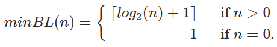

$$X_k = \left\{
   \begin{array}{rl}
     P_k \cup X_{k-1} & ~~\text{if }  k>1 \\
     \{0,1\} & ~~\text{if } k=1.
   \end{array}\right.$$



$$minBL(n)= \left\{
   \begin{array}{rl}
     \lceil log_2(n)+1 \rceil & \text{if }  n > 0 \\
     1 & \text{if } n = 0.
   \end{array}\right.$$


$$P_k = \{\forall x = (k,n) ~|~  n \in \mathbb{N} ~\land~ minBL(n) \le k  \}$$


$$X_k = \{\forall x = (l,n) ~|~  l,n \in \mathbb{N} ~\land~ minBL(n) \le l \le k  \}$$


## UML diagram

```
[SizedBigInt|bits;val|valueOf();toString();fromString();clone();compare();sort();truncAt()]
[BigInt|valueOf();toString();arithmeticOps()]
[SizedBigInt]->[BigInt]
```

## Sized Integers

* Each element of this set can be mapped into a *size* (bits or number of digits) and a Natural number (*value*). &nbsp; PS:  the preferred term for "size of the string" is *length* (or [bit-length](https://en.wikipedia.org/wiki/Bit-length)).

* There are elements in $X_k$ with all lengths, from 1 to  *k*, a finite length. In other words, using the  range set $L_k=\{1, 2, \ldots, k\}$, we can say that all element of  $X_k$ has a bit-length $l \in L_k$, and there are elements for each $l$.

* The  "minimum Bit-Length" of a Natural number $n$  is determined by the function $$minBL(n)= \left\{
   \begin{array}{rl}
     \lceil log_2(n)+1 \rceil & \text{if }  n > 0 \\
     1 & \text{if } n = 0.
   \end{array}\right.$$

Putting all together, the set $X_k$ is a class in a finite $k$:

$$X_k = \{\forall x = (l,n) ~|~  l,n \in \mathbb{N} ~\land~ minBL(n) \le l \le k  \}$$

= USED=

== WORKING ==

Important:

$$X_k = P_k \cup X_{k-1} $$

IMPOrtANTE

$$X_k = \{\forall x = (l,n) ~|~  l,n \in \mathbb{N} ~\land~ minBL(n) \le l \le k  \}$$

$$P_k = \{\forall x = (k,n) ~|~  n \in \mathbb{N} ~\land~ minBL(n) \le k  \}$$
$$X_1 = \{0,1\} $$

$$X_k = P_k \cup X_{k-1} $$

==OLDs==

Latex or math.stackexchange.com text:

$$L_{lmax}=\{1, 2, \ldots, lmax\}$$

$$X_{lmax} = \{\forall x \in (l,n) ~ | ~ l \in L_{lmax} ~\land ~ n \in \mathbb{N} \}$$

$$x=y ~ \iff ~ l_x=l_y \land n_x=n_y$$

$$x>y ~ \iff ~ l_x > l_y ~ \lor ~ (l_x=l_y \land n_x > n_y)$$
